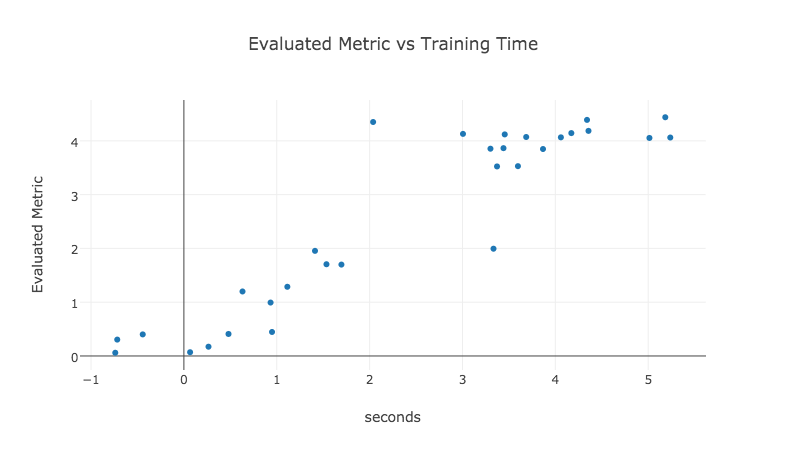

[](https://sigopt.com)

# How are My Hyperparameters Affecting My Training Time?

Example using SigOpt to explore approximated how long it takes to train your models.



## Setup

1. Log in to your SigOpt account at [https://app.sigopt.com](https://app.sigopt.com)
2. Find your API Token on the [API tokens page](https://app.sigopt.com/tokens)
3. Recommended: Set the environment variable `SIGOPT_API_TOKEN` to your API token. Alternative: insert your api token into the jupyter notebook.
4. Clone the repo and install dependencies:

```
git clone https://github.com/sigopt/sigopt-examples.git
cd sigopt-examples/estimated-training-time/
pip install -r requirements.txt
```

## Run

We recommend using [Jupyter](http://jupyter.readthedocs.org/en/latest/install.html) to walk through this example. Run Jupyter:

```
jupyter notebook
```

Then open [`How are My Hyperparameter Affecting My Training Time?.ipynb`](https://github.com/sigopt/sigopt-examples/blob/master/estimated-training-time/How%20are%20My%20Hyperparameters%20Affecting%20My%20Training%20Time%3F.ipynb) in the browser window that pops up.

## Questions?
Any questions? Drop us a line at [support@sigopt.com](mailto:support@sigopt.com).

## API Reference
To implement SigOpt for your use case, feel free to use or extend the code in this repository. Our [core API](https://sigopt.com/docs) can bolt on top of any complex model or process and guide it to its optimal configuration in as few iterations as possible.

## About SigOpt

With SigOpt, data scientists and machine learning engineers can build better models with less trial and error.

Machine learning models depend on hyperparameters that trade off bias/variance and other key outcomes. SigOpt provides Bayesian hyperparameter optimization using an ensemble of the latest research.

SigOpt can tune any machine learning model, including popular techniques like gradient boosting, deep neural networks, and support vector machines. SigOpt’s REST API and client libraries (Python, R, Java) integrate into any existing ML workflow.

SigOpt augments your existing model training pipeline, suggesting parameter configurations to maximize any online or offline objective, such as AUC ROC, model accuracy, or revenue. You only send SigOpt your metadata, not the underlying training data or model.

[Visit our website](https://sigopt.com) to learn more!
